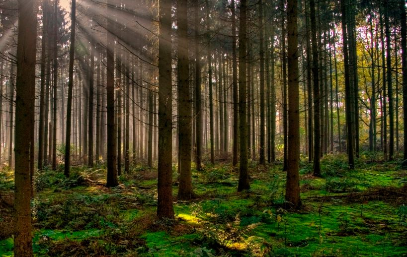
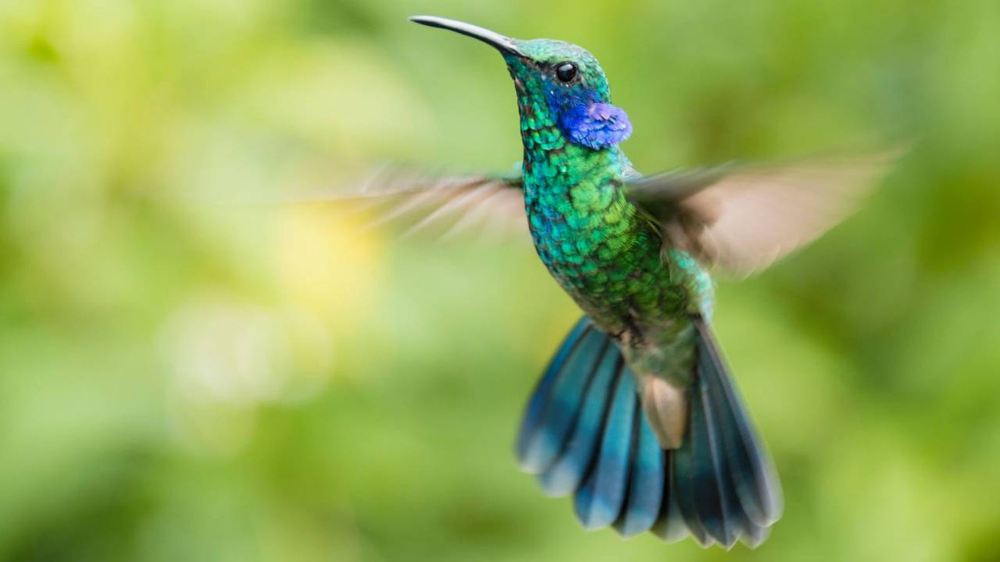
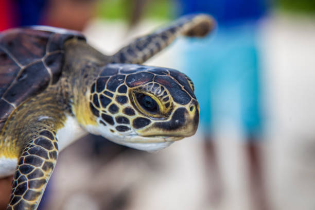

# Etiquetas básicas


## Indica que estamos utilizando HTML5.

```html
<!DOCTYPE html>
```


## Indica que el documento está escrito en español.
```html
<html lang="es">
```


## Contiene información sobre el documento.
```html
<head>
```

## Contiene aquello que verá el usuario.

```html
<body>
```

# Uso de elementos de la  web semántica

            <article>
                <h3>El jaguar vuelve a recorrer los bosques mexicanos</h3>
                <p>
                    Investigadores reportan nuevos registros de jaguares
                    en zonas de conservación.
                </p>
            </article>
*HTML5 no solamente sirve para mostrar información; también permite describir qué significa cada parte de la página.*


```html
<body>

    <header>
        <h1>BioNoticias</h1>
        <p>Actualidad sobre biodiversidad y conservación</p>
    </header>

    <nav>
        <a href="#">Inicio</a>
        <a href="#">Noticias</a>
        <a href="#">Especies</a>
            <article>
                <h3>El jaguar vuelve a recorrer los bosques mexicanos</h3>
                <p>
                    Investigadores reportan nuevos registros de jaguares
                    en zonas de conservación.
                </p>
            </article>
        <a href="#">Conservación</a>
        <a href="#">Videos</a>
    </nav>

    <main>

        <section>
            <h2>Noticias destacadas</h2>

            <article>
                <h3>El jaguar vuelve a recorrer los bosques mexicanos</h3>
                <p>
                    Investigadores reportan nuevos registros de jaguares
                    en zonas de conservación.
                </p>
            </article>

        </section>

    </main>

    <footer>
        <p>© 2026 BioNoticias</p>
    </footer>

</body>

```

Por ejemplo:

```html
<article>
```


indica que tenemos un contenido independiente, en este caso una noticia.


# Creación del menú 

La versión anterior

```html
 <nav>
        <a href="#">Inicio</a>
        <a href="#">Noticias</a>
        <a href="#">Especies</a>
        <a href="#">Conservación</a>
        <a href="#">Videos</a>
    </nav>
```

Se reemplaza por:

```html
<nav class="menu">
    <div class="logo">
        BioNoticias
    </div>
    <div class="enlaces">
        <a href="#inicio">Inicio</a>
        <a href="#noticias">Noticias</a>
        <a href="#especies">Especies</a>
        <a href="#conservacion">Conservación</a>
        <a href="#videos">Videos</a>
    </div>
</nav>
```


Los enlaces utilizan:

```html
href="#noticias"
```

para desplazarse hacia un elemento que tenga:

```html
id="noticias"
```


Por ejemplo:

```html
<section id="noticias">
```

Esto nos permitirá posteriormente crear un efecto de desplazamiento suave con CSS.


# Agregar el primer artículo a la página de noticias

Sustituir el *article* anterior.

```html
<article class="noticia">

    

    <div class="noticia-contenido">

        <span class="categoria">
            Conservación
        </span>

        <h3>
            El jaguar vuelve a recorrer los bosques mexicanos
        </h3>

        <p>
            Nuevos registros obtenidos mediante cámaras trampa
            muestran la presencia de jaguares en diferentes
            regiones naturales.
        </p>

        <time datetime="2026-09-05">
            5 de septiembre de 2026
        </time>

        <a href="#" class="leer-mas">
            Leer noticia ...
        </a>

    </div>

</article>
```


## Elementos relevantes


### alt
```html
alt="Jaguar en un bosque tropical"
```

Ayuda a:

* accesibilidad
* lectores de pantalla
* motores de búsqueda


### time
```html
<time datetime="2026-09-05">
```

Permite identificar semánticamente una fecha.

### Visualmente, se obtiene:


# Agregar 3 noticias similares

* <article> para colibrí
* <article> para bosque
* <article> para tortuga


############################################################################################£


<!DOCTYPE html>
<html lang="es">

<head>
    <meta charset="UTF-8">
    <meta name="viewport" content="width=device-width, initial-scale=1.0">
    <title>BioNoticias</title>
    <link rel="stylesheet" href="css/estilos.css">
</head>

<body>

    <header>
        <h1>BioNoticias</h1>
        <p>Actualidad sobre biodiversidad y conservación</p>
    </header>


    <nav class="menu">

        <div class="logo">
            BioNoticias
        </div>

        <div class="enlaces">

            <a href="#inicio">Inicio</a>
            <a href="#noticias">Noticias</a>
            <a href="#especies">Especies</a>
            <a href="#conservacion">Conservación</a>
            <a href="#videos">Videos</a>

        </div>* {
    box-sizing: border-box;
    margin: 0;
    padding: 0;
}

body {
    font-family: Arial, sans-serif;
    background-color: #f4f7f2;
    color: #263326;
}

.menu {
    display: flex;
    justify-content: space-between;
    align-items: center;

    background-color: #10271c;

    padding: 15px 8%;

    position: sticky;
    top: 0;

    z-index: 1000;
}

.logo {
    color: white;
    font-size: 1.5rem;
    font-weight: bold;
}

.enlaces {
    display: flex;
    gap: 25px;
}

.enlaces a {
    color: white;
    text-decoration: none;
}

    </nav>

    <main>
        <section class="principal">

            

            <div class="principal-texto">

                <span>REPORTAJE ESPECIAL</span>

                <h2>
                    Biodiversidad: el patrimonio natural
                    que debemos proteger
                </h2>

                <p>
                    Los ecosistemas naturales albergan miles de especies
                    y proporcionan servicios fundamentales para las
                    comunidades humanas.
                </p>

                <a href="#">
                    Leer reportaje
                </a>

            </div>

        </section>
        <section>
            <h2>Noticias destacadas</h2>

            <div class="grid-noticias">

                <article class="noticia">

                    

                    <div class="noticia-contenido">

                        <span class="categoria">
                            Conservación
                        </span>

                        <h3>
                            El jaguar vuelve a recorrer los bosques mexicanos
                        </h3>

                        <p>
                            Nuevos registros obtenidos mediante cámaras trampa
                            muestran la presencia de jaguares en diferentes
                            regiones naturales.
                        </p>

                        <time datetime="2026-09-05">
                            5 de septiembre de 2026
                        </time>

                        <a href="#" class="leer-mas">
                            Leer noticia ...
                        </a>

                    </div>

                </article>

                <article class="noticia">

                    

                    <div class="noticia-contenido">

                        <span class="categoria">
                            Conservación
                        </span>

                        <h3>
                            El colibrí se encuentra en las regiones tropicales y subtropicales de América Central y del
                            Sur.
                        </h3>

                        <p>
                            El colibrí es una de las aves más fascinantes del mundo y habita principalmente en el
                            continente
                            americano, desde Alaska hasta Tierra del Fuego, aunque la mayor diversidad de especies se
                            encuentra en las regiones tropicales y subtropicales de América Central y del Sur.
                        </p>


                        <time datetime="2026-04-06">
                            6 de abril de 2026
                        </time>

                        <a href="#" class="leer-mas">
                            Leer noticia ...
                        </a>

                    </div>

                </article>

                <article class="noticia">

                    

                    <div class="noticia-contenido">

                        <span class="categoria">
                            Ecosistemas
                        </span>

                        <h3>
                            Los bosques: el pulmón verde y refugio de nuestra biodiversidad
                        </h3>

                        <p>
                            Estos ecosistemas no solo albergan más del 80% de las especies terrestres,
                            sino que son piezas clave para la regulación climática y el ciclo del agua.
                        </p>

                        <time datetime="2026-09-07">
                            7 de septiembre de 2026
                        </time>

                        <a href="#" class="leer-mas">
                            Leer noticia ...
                        </a>

                    </div>

                </article>

                <article class="noticia">

                    

                    <div class="noticia-contenido">

                        <span class="categoria">
                            Vida Marina
                        </span>

                        <h3>
                            El viaje ancestral de las tortugas hacia las playas de desove
                        </h3>

                        <p>
                            Miles de ejemplares regresan este año a las costas para iniciar su ciclo
                            reproductivo, un espectáculo natural vital para la salud de los océanos.
                        </p>

                        <time datetime="2026-09-07">
                            7 de septiembre de 2026
                        </time>

                        <a href="#" class="leer-mas">
                            Leer noticia ...
                        </a>

                    </div>

                </article>

            </div>


        </section>

    </main>

    <footer>
        <p>© 2026 BioNoticias</p>
    </footer>

</body>

</html>


* {
    box-sizing: border-box;
    margin: 0;
    padding: 0;
}

body {
    font-family: Arial, sans-serif;
    background-color: #f4f7f2;
    color: #263326;
}

header {
    background-color: #183d2b;
    color: white;
    text-align: center;
    padding: 60px 20px;
}

header  h1 {
    font-size: 3rem;
    margin-bottom: 10px;
}

header p {
    font-size: 1.2rem;
}

.menu {
    display: flex;
    justify-content: space-between;
    align-items: center;

    background-color: #10271c;

    padding: 15px 8%;

    position: sticky;
    top: 0;

    z-index: 1000;
}


.logo {
    color: white;
    font-size: 1.5rem;
    font-weight: bold;
}


.enlaces {
    display: flex;
    gap: 45px;
}

.enlaces a {
    color: white;
    text-decoration: none;
}

.enlaces a:hover {  
    text-decoration: underline;
}